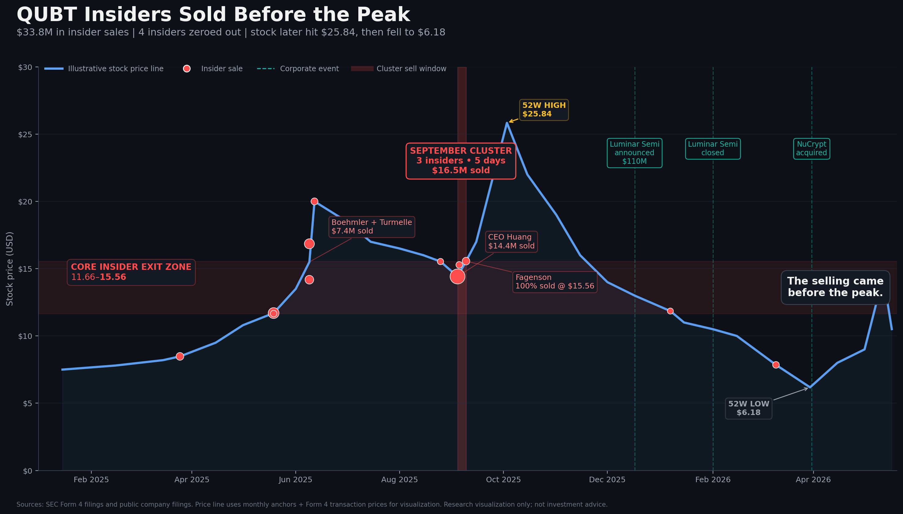

# Insider Narrative Map

A Form 4 filing tells us what an insider did.

This project asks what story the company was selling when they did it.

## QUBT Case Study

Full case study: [QUBT case study PDF](./QUBT%20case%20study.pdf)

Data:
- [QUBT transactions](./QUBT%20transactions.csv)
- [QUBT events](./QUBT%20events.csv)
- [QUBT insiders](./QUBT%20insiders.csv)

## What this project tracks

- SEC Form 4 insider transactions
- Insider exit zones
- Corporate events from 8-K filings
- Board and executive background
- Narrative shifts in small-cap public companies

## First case study

QUBT — Quantum Computing Inc.

This case maps insider selling from Jan 2025 to May 2026 against stock price movement, corporate events, and the company’s narrative transition from quantum computing into photonics, semiconductor assets, and quantum communications.

## Core idea

Most insider tracking tools show raw transactions.

This project connects those transactions to the surrounding corporate story.

It is not a price target system.

It is an insider behavior and narrative research framework.

## Disclaimer

This project is for research and educational purposes only.

Not financial advice.
